# 🤖 Realtime Voice AI Chatbot

A blazing-fast, voice-controlled AI assistant that listens, thinks, and responds with human-like speech in real-time. Built for the future of conversational AI.


## ✨ Features

- 🎤 **Real-time Speech Recognition** - Powered by Vosk offline speech recognition
- 🧠 **GPT-4o Intelligence** - Natural, contextual conversations with OpenAI's latest model
- 🗣️ **Premium Voice Synthesis** - High-quality, natural speech with ElevenLabs TTS
- ⚡ **Low Latency** - Optimized pipeline for near-instant responses
- 🔄 **Persistent Context** - Maintains conversation history throughout the session
- 🎛️ **Voice Activity Detection** - Smart silence detection for seamless interaction

## 🚀 Quick Start

### Prerequisites

```bash
# Install Poetry (if not already installed)
pipx install poetry
```

### Installation

1. **Clone the repository**
   ```bash
   git clone <your-repo-url>
   cd led_controller
   ```

2. **Install dependencies**
   ```bash
   poetry install
   ```

3. **Set up API keys**
   ```bash
   # OpenAI API key
   mkdir -p ~/.api_keys
   echo "your-openai-api-key" > ~/.api_keys/openai_key
   
   # ElevenLabs API key
   export ELEVENLABS_API_KEY="your-elevenlabs-api-key"
   ```

4. **Download speech recognition model**
   ```bash
   # The Vosk model is included in the repo
   # If you need a different model, download from:
   # https://alphacephei.com/vosk/models
   ```

5. **Run the chatbot**
   ```bash
   poetry run python app.py
   ```

## 🎯 How It Works

```mermaid
graph LR
    A[🎤 Microphone] --> B[Vosk STT]
    B --> C[GPT-4o]
    C --> D[ElevenLabs TTS]
    D --> E[🔊 Speakers]
    
    style A fill:#e1f5fe
    style E fill:#e8f5e8
    style C fill:#fff3e0
```



1. **Listen** - Vosk captures and transcribes your speech in real-time
2. **Think** - GPT-4o processes your message with full conversation context
3. **Speak** - ElevenLabs generates natural, human-like speech
4. **Loop** - Maintains context for ongoing conversation

## 🛠️ Technical Stack

| Component | Technology | Purpose |
|-----------|------------|---------|
| **Speech-to-Text** | Vosk | Offline, real-time speech recognition |
| **AI Model** | OpenAI GPT-4o | Natural language understanding & generation |
| **Text-to-Speech** | ElevenLabs | High-quality voice synthesis |
| **Audio Processing** | PyAudio, SoundDevice | Real-time audio I/O |
| **Voice Activity** | WebRTC VAD | Smart silence detection |

## ⚙️ Configuration

### Audio Settings
```python
# audio/translation.py
samplerate = 16000          # Audio sample rate
frame_duration = 30         # Frame duration in ms
max_silence = 33           # Silence frames before stopping
```

### AI Behavior
```python
# llm/prompt.py
model = "gpt-4o"           # OpenAI model
temperature = 0.5          # Response creativity
max_tokens = 100          # Response length limit
```

### Voice Selection
```python
# audio/translation.py
voice_id = "Oe8Lhg3t63j9BsrTQBjx"  # ElevenLabs voice ID
model_id = "eleven_multilingual_v2"  # TTS model
```

## 🎨 Customization

### Change the Voice
1. Browse available voices at [ElevenLabs Voice Library](https://elevenlabs.io/voice-library)
2. Copy the voice ID
3. Update `voice_id` in `audio/translation.py`

### Modify AI Personality
Edit the system prompt in `llm/prompt.py`:
```python
"content": (
    "You are a helpful, voice-based assistant."
    "Speak naturally, like you are talking to a friend."
    # Add your custom personality here
)
```

## 🔧 Troubleshooting

### Common Issues

**"No module named 'vosk'"**
```bash
poetry install  # Reinstall dependencies
```

**"ElevenLabs API Error"**
- Check your API key is set: `echo $ELEVENLABS_API_KEY`
- Verify you have credits remaining in your ElevenLabs account

**"Audio device not found"**
```bash
# List available audio devices
python -c "import sounddevice as sd; print(sd.query_devices())"
```

**Poor speech recognition**
- Ensure you're in a quiet environment
- Speak clearly and at normal volume
- Check microphone permissions

## 🚧 Roadmap

- [ ] **LED Mouth Visualization** - Sync LED patterns with speech
- [ ] **Go Rewrite** - High-performance Go backend
- [ ] **WebSocket API** - Remote client support
- [ ] **Multi-Voice Support** - Switch voices mid-conversation
- [ ] **Docker Deployment** - Containerized setup
- [ ] **Hardware Integration** - Robot head assembly

## 🤝 Contributing

Contributions are welcome! Please feel free to submit pull requests.

## 📄 License

This project is licensed under the MIT License - see the [LICENSE](LICENSE) file for details.

## 🙏 Acknowledgments

- [Vosk](https://alphacephei.com/vosk/) for offline speech recognition
- [OpenAI](https://openai.com/) for GPT-4o
- [ElevenLabs](https://elevenlabs.io/) for premium TTS
- [PyAudio](https://pypi.org/project/PyAudio/) for audio processing

---

**Built with ❤️ for the future of human-AI interaction**